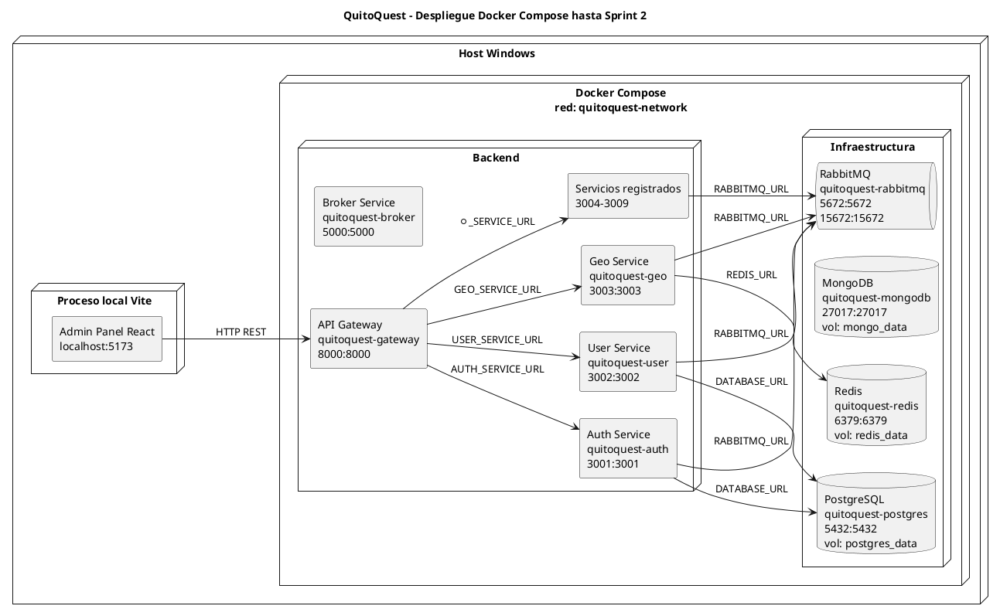
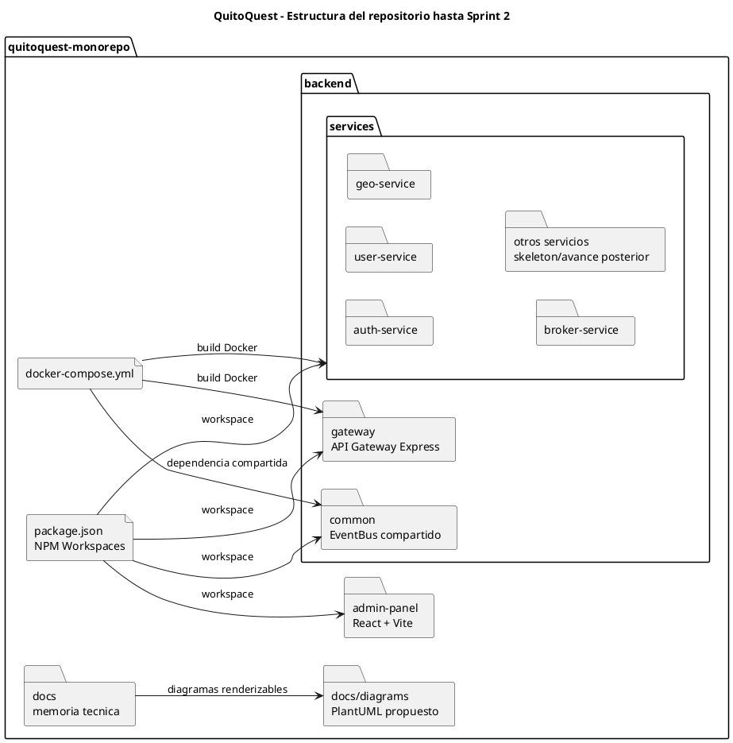
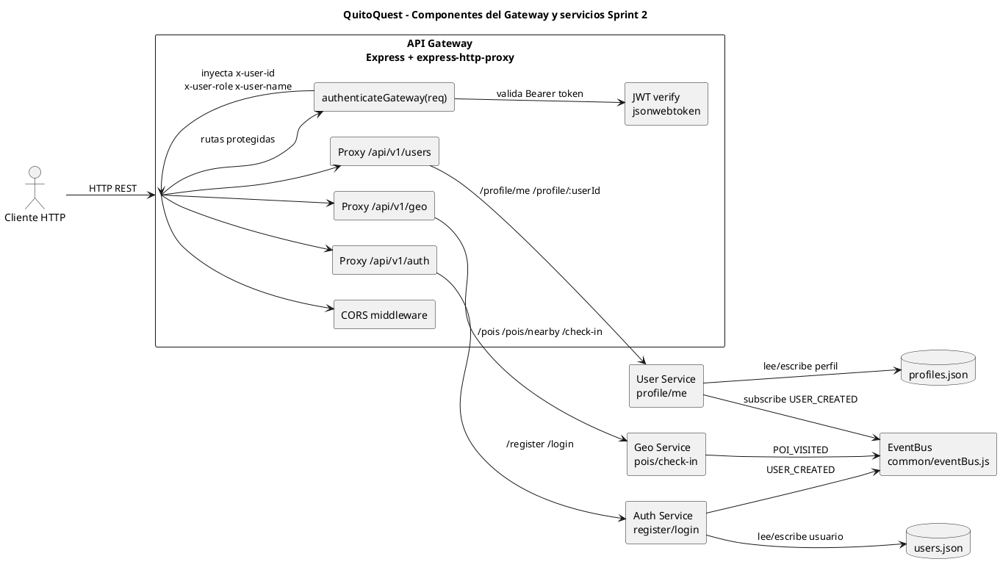
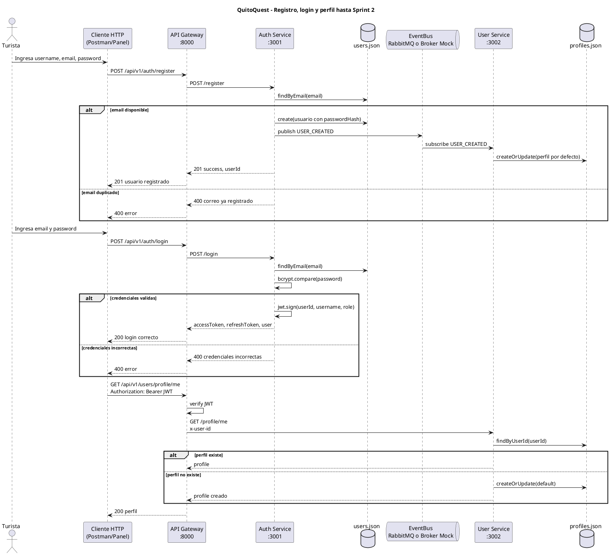
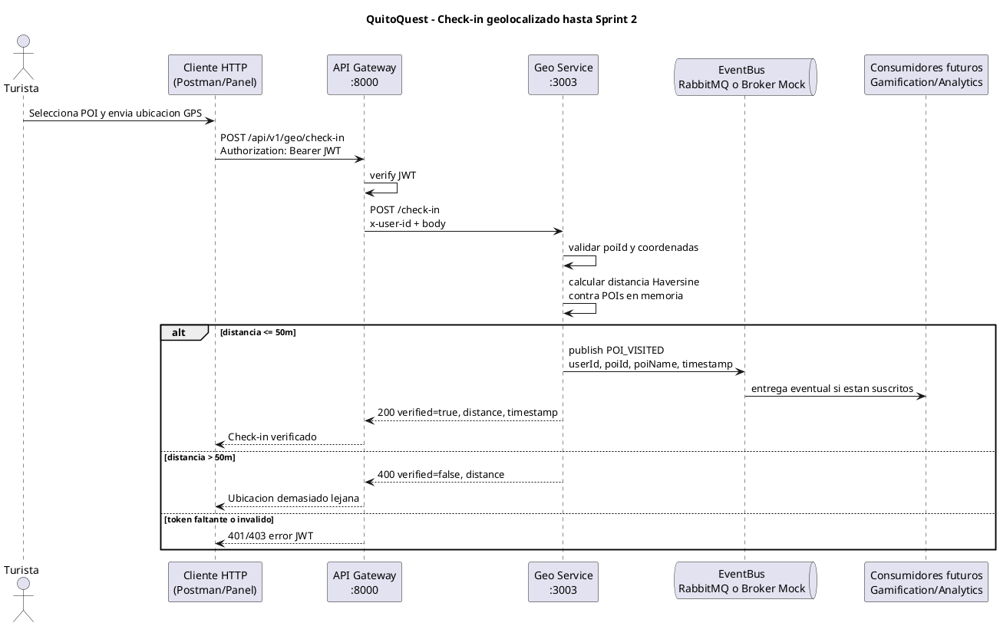
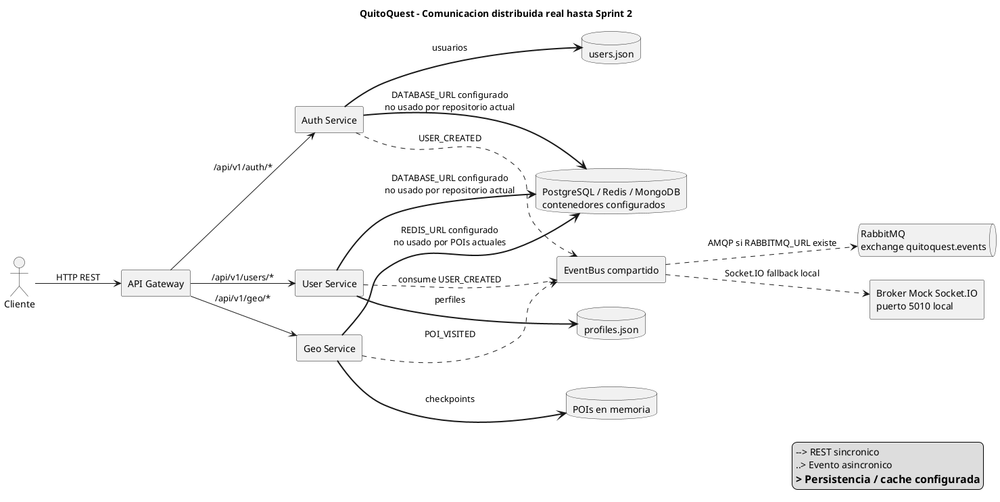
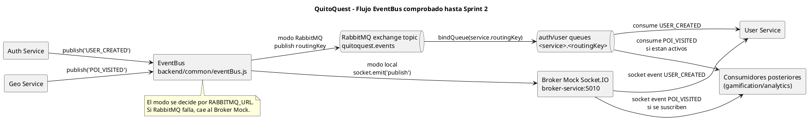

# 18 - Informe y diagramas PlantUML hasta Sprint 2

## Alcance del corte documentado

Este informe consolida el estado estable del proyecto QuitoQuest en la rama `backend-core` hasta el cierre del Sprint 2. El objetivo es dejar una base clara para la memoria tecnica: que se pueda explicar que se implemento, que componentes existen realmente, que diagramas conviene incluir y que evidencias o capturas respaldan cada afirmacion.

El corte incluye:

- Sprint 1: monorepo, Docker Compose, microservicios dockerizados, API Gateway, paquete `backend/common`, broker mock y panel administrativo React.
- Sprint 2: registro, login, JWT, perfil de usuario, intereses, POIs cercanos, calculo Haversine y check-in con geofencing.

No se documentan como terminados los modelos PostgreSQL/MongoDB ni la persistencia Redis GEO, porque el codigo real del Sprint 2 mantiene usuarios y perfiles en JSON local, y los POIs de `geo-service` estan en memoria.

## Evidencia base revisada

- `package.json`: workspaces del monorepo y scripts `dev:*`, `start:backend`, `dev:panel`.
- `docker-compose.yml`: red `quitoquest-network`, contenedores de infraestructura, gateway y microservicios.
- `backend/gateway/src/index.js`: proxy REST, validacion JWT y rutas publicas/protegidas.
- `backend/common/eventBus.js`: EventBus con RabbitMQ y fallback por Broker Mock WebSocket.
- `backend/services/broker-service/src/index.js`: broker local Socket.IO.
- `backend/services/auth-service/src/index.js`: rutas `/register`, `/login`, `/health`.
- `backend/services/auth-service/src/services/authService.js`: hash Bcrypt, JWT, refresh token y evento `USER_CREATED`.
- `backend/services/auth-service/src/repositories/userRepository.js`: persistencia local en `backend/.local_db/users.json`.
- `backend/services/user-service/src/index.js`: rutas `/profile/me`, `/profile/:userId`, suscripcion a `USER_CREATED`.
- `backend/services/user-service/src/repositories/userProfileRepository.js`: persistencia local en `backend/.local_db/profiles.json`.
- `backend/services/geo-service/src/index.js`: POIs, `/pois`, `/pois/nearby`, `/check-in`, Haversine y evento `POI_VISITED`.
- `admin-panel/`: aplicacion React/Vite existente.
- `docs/16_sprint_1_ejecucion.md`: cierre documentado del Sprint 1.
- `docs/17_sprint_2_ejecucion.md`: cierre documentado del Sprint 2.

---

## Diagrama: Arquitectura general Sprint 1-2

### Proposito

Permite entender la vista general del sistema implementado hasta Sprint 2: cliente/panel, gateway, microservicios core, EventBus, almacenamiento local y servicios de infraestructura configurados.

### Evidencia encontrada

- Archivo: `docker-compose.yml`
- Carpeta: `backend/services/`, `backend/gateway/`, `backend/common/`, `admin-panel/`
- Configuracion: variables `AUTH_SERVICE_URL`, `USER_SERVICE_URL`, `GEO_SERVICE_URL`, `RABBITMQ_URL`, `DATABASE_URL`, `REDIS_URL`
- Codigo relacionado: `backend/gateway/src/index.js`, `backend/common/eventBus.js`, `backend/services/auth-service/src/services/authService.js`, `backend/services/geo-service/src/index.js`

### Componentes representados

- API Gateway: punto unico de entrada REST.
- Auth Service: registro, login, JWT y publicacion `USER_CREATED`.
- User Service: perfil e intereses del usuario.
- Geo Service: POIs, cercania, Haversine y check-in.
- EventBus: RabbitMQ en Docker o Broker Mock local.
- JSON local: persistencia real de Sprint 2 para usuarios y perfiles.

### Codigo PlantUML

```plantuml
Permite entender la vista general del sistema implementado hasta Sprint 2: cliente/panel, gateway, microservicios core, EventBus, almacenamiento local y servicios de infraestructura configurados.
```

Ubicacion sugerida en el repositorio

`docs/diagrams/arquitectura-general-sprint-1-2.puml`

Ubicacion sugerida en la memoria tecnica

Capitulo 3. Arquitectura Tecnica Implementada, despues del apartado de vista general.

Captura o exportacion recomendada

Exportar como PNG. Debe verse completa la relacion Cliente -> Gateway -> servicios, y la diferencia entre persistencia real JSON y bases configuradas por Docker.

Observaciones

PostgreSQL, MongoDB y Redis estan configurados en Docker, pero no son la persistencia efectiva de `auth-service`, `user-service` y `geo-service` en Sprint 2.

---

## Diagrama: Despliegue Docker Sprint 1-2

### Proposito

Explica como se despliega el proyecto con Docker Compose: contenedores, puertos, red comun, volumenes y dependencias de infraestructura.

### Evidencia encontrada

- Archivo: `docker-compose.yml`
- Carpeta: `backend/services/*/Dockerfile`, `backend/gateway/Dockerfile`
- Configuracion: red `quitoquest-network`, volumenes `postgres_data`, `mongo_data`, `redis_data`
- Codigo relacionado: scripts de `package.json` y Dockerfiles de servicios.

### Componentes representados

- Host Windows: entorno de ejecucion local.
- Docker Compose: orquestador local.
- Infraestructura: PostgreSQL, MongoDB, Redis, RabbitMQ.
- Backend: gateway y servicios core.
- Admin Panel: proceso Vite local, no contenedor en el compose actual.

### Codigo PlantUML



Ubicacion sugerida en el repositorio

`docs/diagrams/despliegue-docker-sprint-1-2.puml`

Ubicacion sugerida en la memoria tecnica

Capitulo 3. Arquitectura Tecnica Implementada, despues del apartado de infraestructura local.

Captura o exportacion recomendada

Exportar como PNG. Complementar con captura de Docker Desktop mostrando contenedores `quitoquest-*`, o con terminal ejecutando `docker compose ps`.

Observaciones

El panel React se ejecuta con `npm run dev:panel`; no aparece como contenedor en `docker-compose.yml`.

---

## Diagrama: Estructura del repositorio Sprint 1-2

### Proposito

Muestra como esta organizado el monorepo sin caer en detalle archivo por archivo.

### Evidencia encontrada

- Archivo: `package.json`
- Carpeta: `admin-panel/`, `backend/common/`, `backend/gateway/`, `backend/services/`, `docs/`
- Configuracion: workspaces NPM
- Codigo relacionado: scripts `dev:*`, `start:backend`, `dev:panel`

### Componentes representados

- Aplicacion React.
- Backend compartido.
- Gateway.
- Microservicios.
- Infraestructura y documentacion.

### Codigo PlantUML



Ubicacion sugerida en el repositorio

`docs/diagrams/estructura-repositorio-sprint-1-2.puml`

Ubicacion sugerida en la memoria tecnica

Capitulo 4. Estructura del Proyecto y Organizacion del Codigo.

Captura o exportacion recomendada

Exportar como PNG. Tambien se puede tomar captura del explorador de VS Code con carpetas principales abiertas.

Observaciones

No conviene mostrar todos los archivos porque saturaria el diagrama y no aporta a la defensa tecnica.

---

## Diagrama: Componentes Gateway y Sprint 2

### Proposito

Detalla como el Gateway valida JWT, inyecta cabeceras internas y redirige a `auth-service`, `user-service` y `geo-service`.

### Evidencia encontrada

- Archivo: `backend/gateway/src/index.js`
- Carpeta: `backend/services/auth-service/`, `backend/services/user-service/`, `backend/services/geo-service/`
- Configuracion: `JWT_SECRET`, `AUTH_SERVICE_URL`, `USER_SERVICE_URL`, `GEO_SERVICE_URL`
- Codigo relacionado: `authService.js`, `user-service/src/index.js`, `geo-service/src/index.js`

### Componentes representados

- Middleware JWT.
- Proxies REST.
- Servicios core de Sprint 2.
- Repositorios JSON.
- EventBus.

### Codigo PlantUML



Ubicacion sugerida en el repositorio

`docs/diagrams/componentes-gateway-sprint-2.puml`

Ubicacion sugerida en la memoria tecnica

Capitulo 7. Microservicios Implementados, dentro del apartado del API Gateway.

Captura o exportacion recomendada

Exportar como PNG. En la memoria debe verse con claridad que `GET /geo/pois` es publico y `profile/me` y `check-in` son protegidos.

Observaciones

El Gateway tambien registra rutas a servicios posteriores, pero el diagrama se centra en Sprint 2 para evitar ruido.

---

## Diagrama: Registro, login y perfil

### Proposito

Explica el flujo de autenticacion y perfil de usuario desde cliente hasta repositorios locales, incluyendo evento `USER_CREATED`.

### Evidencia encontrada

- Archivo: `backend/services/auth-service/src/index.js`
- Carpeta: `backend/services/auth-service/`, `backend/services/user-service/`
- Configuracion: `JWT_SECRET`, `BROKER_URL`, `RABBITMQ_URL`
- Codigo relacionado: `authController.js`, `authService.js`, `userRepository.js`, `userProfileRepository.js`

### Componentes representados

- Turista / cliente.
- Gateway.
- Auth Service.
- User Service.
- JSON local.
- EventBus.

### Codigo PlantUML



Ubicacion sugerida en el repositorio

`docs/diagrams/registro-login-perfil-sequence.puml`

Ubicacion sugerida en la memoria tecnica

Capitulo 5. Proceso de Implementacion, Sprint 2, subseccion Autenticacion y Usuarios.

Captura o exportacion recomendada

Exportar como PNG. Complementar con capturas de Postman/Thunder Client para `register`, `login` y `profile/me`.

Observaciones

El evento `USER_CREATED` puede ir por RabbitMQ en Docker o por Broker Mock local. Si el broker no esta disponible, `profile/me` tiene fallback creando perfil por defecto.

---

## Diagrama: Check-in geolocalizado

### Proposito

Muestra como se valida una visita a un POI con JWT, coordenadas, calculo Haversine y publicacion del evento `POI_VISITED`.

### Evidencia encontrada

- Archivo: `backend/services/geo-service/src/index.js`
- Carpeta: `backend/services/geo-service/`
- Configuracion: `GEO_SERVICE_URL`, `RABBITMQ_URL`
- Codigo relacionado: `backend/gateway/src/index.js`, `backend/common/eventBus.js`

### Componentes representados

- Cliente.
- Gateway.
- Geo Service.
- EventBus.
- Consumidores posteriores si estan activos.

### Codigo PlantUML



Ubicacion sugerida en el repositorio

`docs/diagrams/checkin-sequence-sprint-2.puml`

Ubicacion sugerida en la memoria tecnica

Capitulo 5. Proceso de Implementacion, Sprint 2, subseccion Geolocalizacion y Check-in.

Captura o exportacion recomendada

Exportar como PNG. Complementar con dos capturas: check-in exitoso en San Francisco y check-in fallido por distancia.

Observaciones

Los POIs estan definidos como arreglo en memoria dentro de `geo-service`. Redis esta configurado en Docker, pero todavia no almacena los checkpoints.

---

## Diagrama: Comunicacion distribuida

### Proposito

Diferencia REST sincronico, eventos asincronicos, persistencia local y servicios de infraestructura configurados.

### Evidencia encontrada

- Archivo: `backend/gateway/src/index.js`
- Carpeta: `backend/common/`, `backend/services/`
- Configuracion: `RABBITMQ_URL`, `BROKER_URL`, `DATABASE_URL`, `REDIS_URL`
- Codigo relacionado: `backend/common/eventBus.js`, `backend/services/broker-service/src/index.js`

### Componentes representados

- REST por Gateway.
- EventBus asincronico.
- RabbitMQ o Broker Mock.
- Persistencia JSON real.
- Infraestructura configurada pero no totalmente usada en Sprint 2.

### Codigo PlantUML



Ubicacion sugerida en el repositorio

`docs/diagrams/comunicacion-distribuida-sprint-1-2.puml`

Ubicacion sugerida en la memoria tecnica

Capitulo 8. Comunicacion entre Microservicios.

Captura o exportacion recomendada

Exportar como PNG o SVG. Debe verse la leyenda y la diferencia entre flechas REST, eventos y persistencia.

Observaciones

Este diagrama ayuda a explicar por que el proyecto ya tiene patrones distribuidos aunque parte de la persistencia siga local para el Sprint 2.

---

## Diagrama: Flujo EventBus

### Proposito

Explica como se publican y consumen eventos mediante `EventBus`, diferenciando RabbitMQ en Docker y Broker Mock local.

### Evidencia encontrada

- Archivo: `backend/common/eventBus.js`
- Carpeta: `backend/services/broker-service/`
- Configuracion: exchange `quitoquest.events`, colas `${serviceName}.${routingKey}`, `BROKER_URL=http://localhost:5010`
- Codigo relacionado: `authService.js`, `geo-service/src/index.js`, `user-service/src/index.js`

### Componentes representados

- Productores: Auth y Geo.
- EventBus.
- RabbitMQ exchange topic.
- Broker Mock Socket.IO.
- Consumidor real de Sprint 2: User Service.
- Consumidores posteriores si estan activos.

### Codigo PlantUML



Ubicacion sugerida en el repositorio

`docs/diagrams/flujo-eventbus-sprint-2.puml`

Ubicacion sugerida en la memoria tecnica

Capitulo 8. Comunicacion entre Microservicios, despues de explicar mensajeria asincronica.

Captura o exportacion recomendada

Exportar como PNG. Complementar con captura de RabbitMQ Management en `http://localhost:15672` si se levanta Docker.

Observaciones

Para Sprint 2, el consumidor comprobado de `USER_CREATED` es `user-service`. `POI_VISITED` queda listo para Sprint 3, donde gamificacion y analitica pueden consumirlo.

---

## Diagramas evaluados y aplicabilidad

| Diagrama | Existe actualmente | Debe crearse | Capitulo | Archivo propuesto | Evidencia |
| --- | --- | --- | --- | --- | --- |
| Arquitectura general | No | Si | 3 | `docs/diagrams/arquitectura-general-sprint-1-2.puml` | `docker-compose.yml`, `gateway`, `common`, servicios Sprint 2 |
| Despliegue Docker | No | Si | 3 | `docs/diagrams/despliegue-docker-sprint-1-2.puml` | `docker-compose.yml`, Dockerfiles |
| Componentes Gateway/Sprint 2 | No | Si | 7 | `docs/diagrams/componentes-gateway-sprint-2.puml` | `backend/gateway/src/index.js` |
| Registro-login-perfil | No | Si | 5 | `docs/diagrams/registro-login-perfil-sequence.puml` | `auth-service`, `user-service` |
| Check-in geolocalizado | No | Si | 5 | `docs/diagrams/checkin-sequence-sprint-2.puml` | `geo-service`, `gateway`, `EventBus` |
| Comunicacion distribuida | No | Si | 8 | `docs/diagrams/comunicacion-distribuida-sprint-1-2.puml` | REST proxy + EventBus |
| Flujo RabbitMQ/EventBus | No | Si | 8 | `docs/diagrams/flujo-eventbus-sprint-2.puml` | `backend/common/eventBus.js` |
| Estructura del repositorio | No | Si | 4 | `docs/diagrams/estructura-repositorio-sprint-1-2.puml` | `package.json`, carpetas principales |
| Modelo de datos PostgreSQL | No | No por ahora | 6 | No aplicable en Sprint 2 | No hay migraciones/modelos SQL reales para auth/user |
| Modelo MongoDB | No | No por ahora | 6 | No aplicable en Sprint 2 | No hay colecciones modeladas para el corte Sprint 2 |
| Recompensas sequence | No | Recomendado despues | Sprint 3/4 | Pendiente | No corresponde al objetivo Sprint 2 |

## Clasificacion final

### Obligatorios para la memoria

- Arquitectura general Sprint 1-2.
- Despliegue Docker Sprint 1-2.
- Componentes Gateway y Sprint 2.
- Registro, login y perfil.
- Check-in geolocalizado.
- Comunicacion distribuida.

### Recomendados

- Flujo EventBus.
- Estructura del repositorio.

### No aplicables al estado actual del Sprint 2

- Modelo de datos PostgreSQL completo.
- Modelo MongoDB completo.
- Recompensas sequence.
- Asignacion completa de XP como cierre funcional.

## Capturas recomendadas para la memoria

### Capturas de ejecucion

- Terminal con `git status --short --branch` mostrando `backend-core`.
- Terminal con `npm install` o `npm -v` / `node -v`.
- Terminal con `docker compose config --quiet`.
- Docker Desktop o terminal con `docker compose ps`, mostrando gateway, auth, user, geo, rabbitmq, postgres, redis y mongodb si se levantan.
- Navegador o Postman con `GET http://localhost:8000/health`.

### Capturas de Sprint 2

- Postman/Thunder Client: `POST /api/v1/auth/register` con respuesta `userId`.
- Postman/Thunder Client: `POST /api/v1/auth/login` con `accessToken` y `refreshToken`.
- Postman/Thunder Client: `GET /api/v1/users/profile/me` usando `Authorization: Bearer <JWT>`.
- Postman/Thunder Client: `GET /api/v1/geo/pois/nearby?lat=-0.22056&lng=-78.51429&radius=300`.
- Postman/Thunder Client: `POST /api/v1/geo/check-in` exitoso con `verified: true`.
- Postman/Thunder Client: `POST /api/v1/geo/check-in` fallido por distancia con `verified: false`.

### Capturas de codigo

- VS Code: `backend/gateway/src/index.js`, mostrando `authenticateGateway`.
- VS Code: `backend/services/auth-service/src/services/authService.js`, mostrando Bcrypt, JWT y `USER_CREATED`.
- VS Code: `backend/services/geo-service/src/index.js`, mostrando Haversine y `POI_VISITED`.
- VS Code: `backend/common/eventBus.js`, mostrando RabbitMQ + fallback mock.

### Imagenes de diagramas

Las imagenes salen de renderizar los archivos `.puml` de `docs/diagrams/`.

Opciones:

- Extension de VS Code: PlantUML.
- Web local o herramienta CLI de PlantUML.
- Exportar cada diagrama como PNG para Word/PDF.
- Exportar como SVG si la memoria se arma en HTML o si se requiere nitidez escalable.

Recomendacion practica: usar PNG para el documento final y conservar los `.puml` como evidencia editable en el repositorio.
